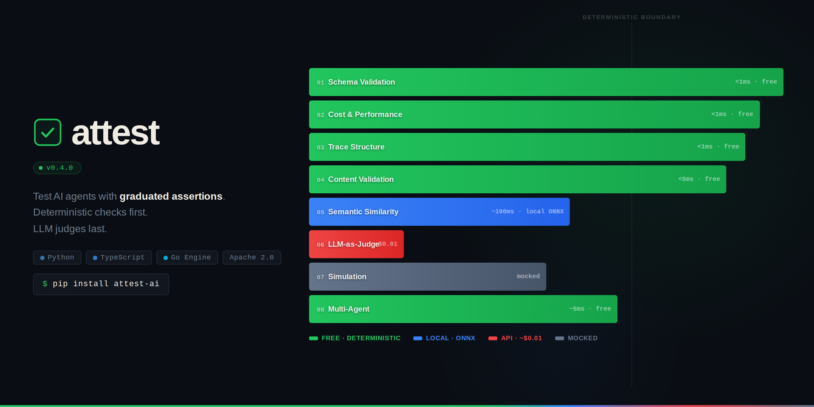

[](https://attest-framework.github.io/attest/)

---

# Attest

**Test your AI agents like you test your code.**

[Documentation](https://attest-framework.github.io/attest-website/) | [Examples](https://github.com/attest-framework/attest-examples) | [Contributing](CONTRIBUTING.md)

Attest is an open-source testing framework purpose-built for AI agents and LLM-powered systems. It treats deterministic assertions as first-class citizens alongside probabilistic evaluation — because 70% of your agent's testable surface is deterministic.

> **Status:** v0.7.0 — 8 assertion layers, 11 adapters (Python) + 7 adapters (TypeScript incl. LangChain.js), continuous eval, drift detection, plugin system, result history (SQLite), CLI (Python + TypeScript), budget tracking, engine timeouts, concurrent evaluation, schema caching, branded types, CJS/ESM dual output, pytest + vitest integrations, comprehensive test coverage.

---

## Why Attest

The current ecosystem defaults to LLM-as-judge for everything. This creates cost explosion, flaky tests, and slow suites. Attest provides a graduated 8-layer assertion model that reaches for the cheapest valid assertion first:

```
Layer 1: Schema Validation        — free, instant, deterministic
Layer 2: Constraint Checks        — free, instant, deterministic
Layer 3: Trace/Behavioral Checks  — free, instant, deterministic
Layer 4: Content Pattern Matching  — free, instant, near-deterministic
Layer 5: Embedding Similarity      — ~$0.001, ~100ms, near-deterministic
Layer 6: LLM-as-Judge             — ~$0.01+, ~1-3s, non-deterministic
Layer 7: Simulation               — free (mocked), variable
Layer 8: Multi-Agent              — free, instant, deterministic
```

## What It Looks Like

```python
from attest import agent, expect

@agent("refund-agent")
def refund_agent(builder, order_id):
    builder.add_tool_call("lookup_order", args={"order_id": order_id},
                          result={"status": "delivered", "amount": 89.99})
    builder.add_tool_call("process_refund", args={"order_id": order_id},
                          result={"refund_id": "RFD-001"})
    builder.set_metadata(cost_usd=0.005, total_tokens=150, latency_ms=1200)
    return {"message": "Your refund of $89.99 has been processed.",
            "structured": {"refund_id": "RFD-001"}}

def test_refund(attest):
    result = refund_agent(order_id="ORD-123456")

    chain = (
        expect(result)
        # Layer 1 — schema (free, instant)
        .output_matches_schema({"type": "object", "required": ["refund_id"]})
        # Layer 2 — constraints (free, instant)
        .cost_under(0.05)
        # Layer 3 — trace (free, instant)
        .tools_called_in_order(["lookup_order", "process_refund"])
        # Layer 4 — content (free, instant)
        .output_contains("refund")
        .output_not_contains("sorry")
        # Layer 6 — LLM judge (only when needed)
        .passes_judge("Is the response helpful and accurate?")
    )

    attest.evaluate(chain)
```

## Architecture

Attest follows a **protocol-first, engine-centric architecture** inspired by LSP and Playwright:

- **Core engine** (Go) — single binary, handles all evaluation, assertion, and simulation logic
- **Language SDKs** (Python, TypeScript, Go) — thin, idiomatic wrappers that communicate with the engine via JSON-RPC 2.0 over stdio
- **Protocol** — SDK spawns engine as subprocess; capability negotiation decouples SDK and engine release cycles

```text
SDK (Python/TS/Go) ──stdin/stdout──▶ Engine Process (Go)
                                        ├── Trace Processor
                                        ├── 8-Layer Assertion Pipeline
                                        ├── Result History (SQLite)
                                        ├── Drift Detection (σ-based)
                                        ├── Simulation Runtime
                                        └── Report Generator
```

## Key Features

- **8-layer assertion pipeline** — graduated from free/deterministic to paid/probabilistic
- **11 Python adapters** — OpenAI, Anthropic, Gemini, Ollama, LangChain, Google ADK, LlamaIndex, CrewAI, OTel, Manual, Simulation
- **7 TypeScript adapters** — OpenAI, Anthropic, Gemini, Ollama, LangChain.js, OTel, Manual
- **Soft failure budgets** — scores between 0.5–0.8 warn without blocking CI
- **Cost as a test metric** — assert on token usage, API cost, and latency
- **Budget enforcement** — configurable max cost per evaluation batch via `ATTEST_BUDGET_MAX_COST`
- **Python & TypeScript SDKs** — `attest-ai` (PyPI) + `@attest-ai/core` / `@attest-ai/vitest` (npm)
- **TypeScript CLI** — `npx @attest-ai/core init`, `validate`, `cache stats/clear`
- **CJS/ESM dual output** — TypeScript SDK supports both `require()` and `import`, tree-shakeable
- **Branded types** — `TraceId`, `AssertionId`, `AgentId` prevent accidental string assignment (TypeScript)
- **Discriminated union specs** — type-safe assertion specs per layer (TypeScript)
- **Local ONNX embeddings** — optional all-MiniLM-L6-v2 provider, zero API cost for Layer 5
- **Judge meta-evaluation** — 3x judge runs with median scoring and variance detection
- **CI-ready** — composite GitHub Action, tiered testing workflow, adversarial hardening
- **Simulation runtime** — simulated users with personas, mock tools, fault injection, multi-turn orchestration
- **Multi-agent testing** — hierarchical trace trees, cross-agent assertions, delegation tracking, temporal assertions, aggregate metrics
- **Continuous eval & drift detection** — sample production traces, σ-based drift alerts to webhooks/Slack (Python + TypeScript)
- **Plugin system** — extend with custom assertions via `attest.plugins` entry points (Python + TypeScript)
- **Result history** — SQLite-backed with configurable retention, automatic pruning
- **Engine performance** — schema compiler cache, deferred LRU writes, batch SQL eviction, `segmentio/encoding` (2.4x JSON speedup)
- **Configurable timeouts** — engine read timeout, concurrent request support, judge cache sizing
- **CLI** — `attest init` scaffolding and `attest validate` config checking (Python + TypeScript)
- **Single binary engine** — no runtime dependencies, cross-platform

## Repository Layout

```test
attest/
├── proto/              # Protocol specification (JSON-RPC 2.0)
├── engine/             # Core engine (Go)
│   ├── cmd/            # CLI entrypoint
│   ├── internal/       # Assertion pipeline, trace model, simulation
│   └── pkg/            # Public Go packages
├── sdks/
│   ├── python/         # Python SDK (PyPI: attest-ai)
│   ├── typescript/     # TypeScript SDK (npm: @attest-ai/core)
│   └── go/             # Go SDK
├── .github/
│   └── actions/        # Reusable composite actions (setup-attest)
├── docs/               # Documentation
├── examples/           # Standalone example projects (incl. CI workflows)
└── scripts/            # Build and development scripts
```

## Quick Start

### Prerequisites

- Go 1.25+
- Python 3.10+ with [uv](https://docs.astral.sh/uv/getting-started/installation/)
- Node.js 18+ with [pnpm](https://pnpm.io/installation) (for TypeScript SDK)

### Build and Test

```bash
git clone https://github.com/attest-framework/attest.git
cd attest

# Build engine + install Python SDK
make dev-setup

# Run all tests
make test

# Verify engine
./bin/attest-engine version
# attest-engine 0.4.0
```

### TypeScript SDK

```bash
cd sdks/typescript
pnpm install
pnpm build
pnpm test
```

Install in your project:

```bash
pnpm add @attest-ai/core @attest-ai/vitest
```

## Roadmap

| Phase | Version     | Status       | Description                                                                                       |
| ----- | ----------- | ------------ | ------------------------------------------------------------------------------------------------- |
| 0     | —           | **Complete** | Repository scaffolding, toolchain, protocol spec                                                  |
| 1     | v0.1        | **Complete** | Go engine (Layers 1–4), Python SDK, pytest plugin, 4 LLM adapters                                 |
| 2     | v0.2        | **Complete** | Layers 5–6 (embeddings, LLM-as-judge), soft failures, CI integration                              |
| 3     | v0.3        | **Complete** | Simulation runtime, multi-agent testing, TypeScript SDK, framework adapters, temporal assertions  |
| 4     | v0.4        | **Complete** | Continuous eval, drift detection, plugin system, CrewAI adapter, result history, CLI, MkDocs docs |
| 5     | v0.5.0–0.5.1 | **Complete** | Correctness fixes (adapters, event loops, plugin wiring), robustness (timeouts, budgets, retention) |
| 6     | v0.6.0–0.6.1 | **Complete** | Engine performance (schema cache, segmentio/encoding), TypeScript parity (plugins, continuous eval, LangChain.js, branded types, CJS dual output) |
| 7     | v0.7.0      | **Complete** | Production hardening (engine/SDK/vitest test coverage, TypeScript CLI, docs, TypeScript examples) |
| 8     | v0.8        | Planned      | Go SDK, Attest Cloud MVP, benchmark registry                                                      |

## Contributing

See [CONTRIBUTING.md](CONTRIBUTING.md) for development setup, workflow, and code standards.

## License

[Apache License 2.0](LICENSE)
